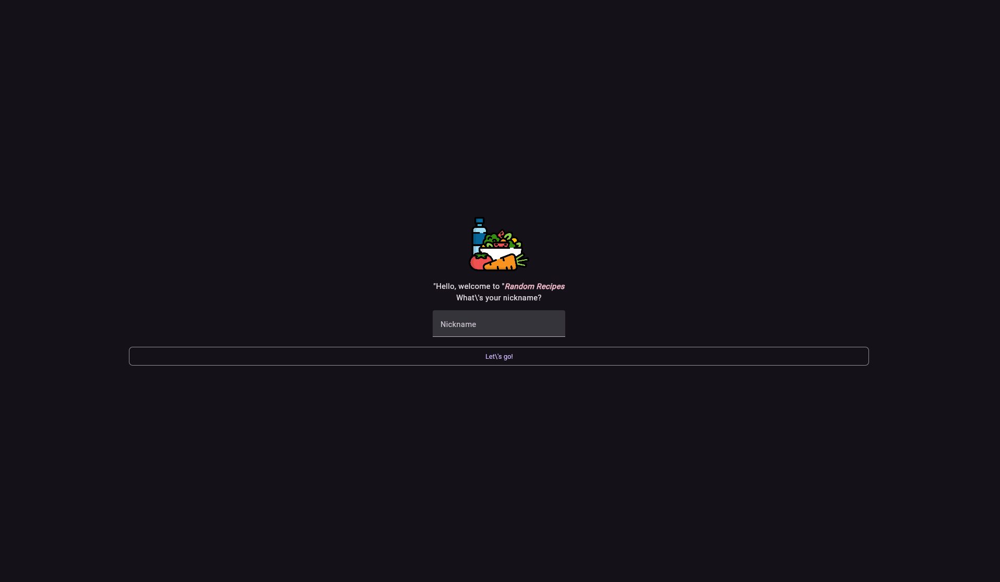
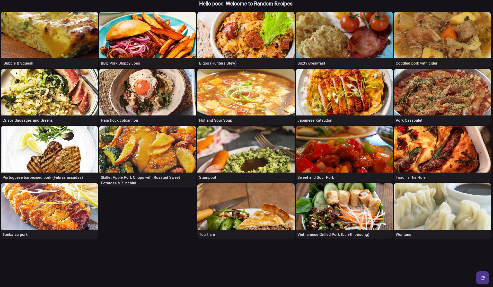
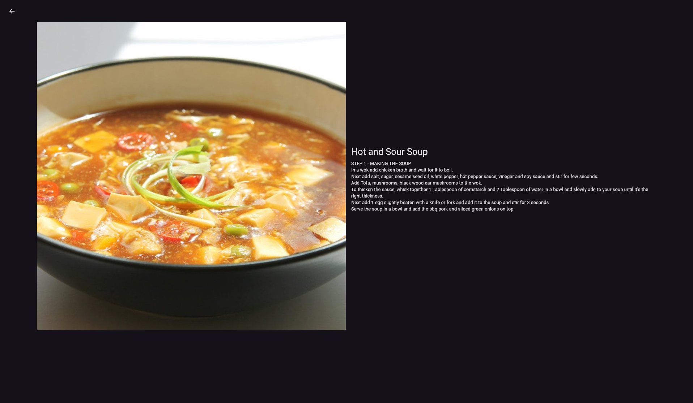
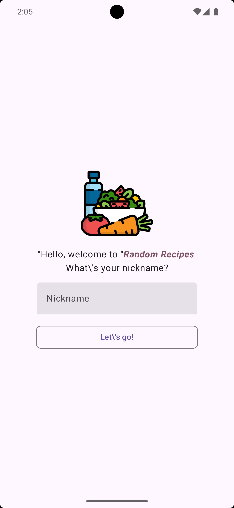
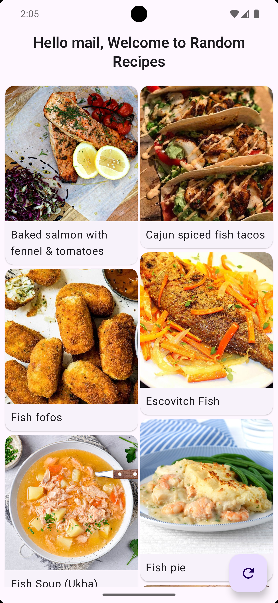
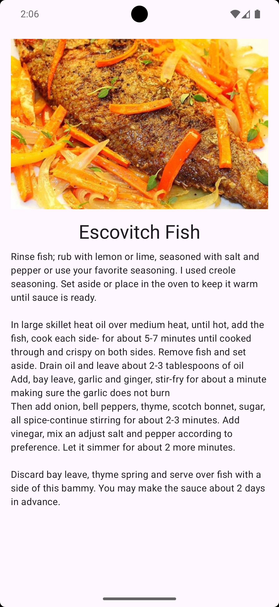

# 🍽️ RandomRecipes - From Android Jetpack Compose to Compose Multiplatform (Kotlin/Wasm)

This project demonstrates how to migrate a simple **Jetpack Compose-based meal recipe app** from an Android-only implementation to a **Compose Multiplatform** project targeting **Web (Kotlin/Wasm)**.

## 🚀 Overview

Jetpack Compose is not just for Android anymore! This sample project shows how you can reuse existing Jetpack Compose code and shared Kotlin logic to build a cross-platform application that runs on:

- ✅ Android
- 🌐 Web (Kotlin/Wasm - Compose Multiplatform)

---

## 🎯 Goals

- Showcase how to extend an Android Jetpack Compose app to support Web via Kotlin/Wasm.
- Maintain a single source of truth for business logic and UI components where possible.
- Demonstrate real-world multiplatform project structure and tooling.
- Compare and contrast platform-specific adaptations vs shared UI.

---

## 🧑‍🍳 Features

- 🍲 Browse a list of meals with preview images
- 📜 View detailed recipe instructions
- 🔍 Refresh list of meals
- 🌐 Works across Android & Web

---

## 🛠️ Tech Stack

- **Kotlin Multiplatform**
- **Jetpack Compose (Android + Multiplatform)**
- **Kotlin/Wasm**
- **Gradle Kotlin DSL**
- *(Optional)*: Ktor for API calls, Kotlinx Serialization for JSON

---

## 🚦 Getting Started

### Prerequisites

- JDK 17+
- IntelliJ IDEA (Multiplatform plugin recommended)
- Node.js (for Web/Wasm target)
- Android SDK (for Android app)

### Run on Android

```bash
./gradlew installDebug
```

### Run on Web (Wasm)

```bash
cd composeApp
./gradlew wasmJsBrowserRun
```

---

## 🔄 Migration Journey

Since the original app already uses **Jetpack Compose**, the focus of migration is:

| Aspect              | Before (Android)             | After (Multiplatform)          |
|---------------------|------------------------------|---------------------------------|
| UI                  | Jetpack Compose               | Compose Multiplatform           |
| Logic               | Kotlin                        | Shared Kotlin (commonMain)     |
| Navigation          | Android Navigation Compose    | Custom/shared navigation logic  |
| Platform Support    | Android only                  | Android + Web (Wasm)     |

Check out the `starter` branch for the original Compose code, and `final` for the multiplatform refactor.

---

## 📸 Screenshots

|          |          |          |
|-----------------------------------|-----------------------------------|-----------------------------------|
|  |  |  |

---

## 🧪 Testing

To run shared tests:

```bash
./gradlew :allTests
```

---

## 🙌 Contributions

Got an idea, improvement, or bug fix? Feel free to open an issue or submit a PR!

---

## 📄 License

MIT License

---

## 👤 Author

Crafted by [otsembo](https://github.com/otsembo) with  ☕ and 🍜.
